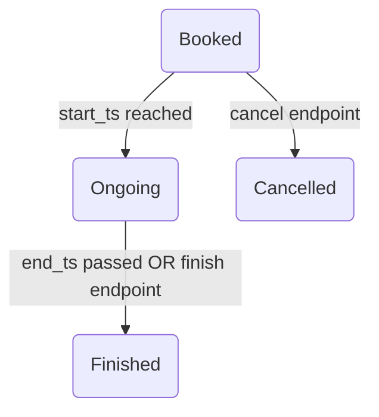

# Smart Parking API Documentation

**Version 1.0 – July 1, 2025**

Base URL prefix: **`/api`**

Authentication: JSON Web Token (JWT) issued via **POST `/api/auth/login`**.  
Include the token in every protected request:

```http
Authorization: Bearer <jwt_token>
Content-Type: application/json
```

---

## Table of Contents

1. [Authentication](#authentication)
2. [Error Handling](#error-handling)
3. [Resource Endpoints](#resource-endpoints)
   - [Auth](#auth)
   - [Users](#users)
   - [Parking Locations](#parking-locations)
   - [Parking Slots](#parking-slots)
   - [Reservations](#reservations)
   - [Reports / Analytics](#reports-analytics)
   - [Health](#health)
4. [Data Schemas](#data-schemas)
5. [Database Models](#database-models)
6. [Business Rules & Status Flows](#business-rules--status-flows)
7. [Changelog](#changelog)

---

## Authentication

| Endpoint         | Method | Public? | Body Schema  | Success (200/201)                 | Errors                                                              |
| ---------------- | ------ | ------- | ------------ | --------------------------------- | ------------------------------------------------------------------- |
| `/auth/register` | `POST` | Yes     | **Register** | `201` Created – `{{ id, email }}` | `400` Validation, `409` Duplicate                                   |
| `/auth/login`    | `POST` | Yes     | **Login**    | `200` – `{{ access_token }}`      | `400` Validation, `401` Invalid credentials, `403` Disabled account |

---

## Error Handling

All error responses are JSON with a short `error` message or `errors` dict.

```jsonc
// Example
{
  "error": "Slot already booked for this time"
}
```

Common status codes:

| Code  | Meaning                                     |
| ----- | ------------------------------------------- |
| `400` | Bad request / validation error              |
| `401` | Authentication failed                       |
| `403` | Forbidden (authenticated but not permitted) |
| `404` | Resource not found                          |
| `409` | Conflict (duplicate key)                    |
| `500` | Unhandled server error                      |

---

## Resource Endpoints

### Auth

| Method | Path             | Body Schema | Success                  | Notes                         |
| ------ | ---------------- | ----------- | ------------------------ | ----------------------------- |
| `POST` | `/auth/register` | Register    | `201` `{ id, email }`    |                               |
| `POST` | `/auth/login`    | Login       | `200` `{ access_token }` | Returns JWT with `role` claim |

### Users

| Method   | Path                          | Privilege    | Body Schema                      | Success           | Notes               |
| -------- | ----------------------------- | ------------ | -------------------------------- | ----------------- | ------------------- |
| `POST`   | `/users/`                     | Admin        | User                             | `201` `{ user }`  | Create new user     |
| `GET`    | `/users/`                     | Admin        | –                                | `200` `{ users }` | List all users      |
| `GET`    | `/users/me`                   | Self         | –                                | `200` `{ user }`  | Current user        |
| `GET`    | `/users/<id>`                 | Self / Admin | –                                | `200` `{ user }`  |                     |
| `PUT`    | `/users/<id>`                 | Self / Admin | User (partial)                   | `200` `{ user }`  |                     |
| `DELETE` | `/users/<id>`                 | Admin        | –                                | `204`             | Hard delete         |
| `POST`   | `/users/<id>/deactivate`      | Admin        | –                                | `200` `{ user }`  | Sets `active=false` |
| `POST`   | `/users/<id>/change-password` | Self         | `{ old_password, new_password }` | `200`             |                     |

### Parking Locations

| Method   | Path                               | Privilege | Body Schema               | Success               | Notes                                |
| -------- | ---------------------------------- | --------- | ------------------------- | --------------------- | ------------------------------------ |
| `POST`   | `/parking_location/locations`      | Admin     | ParkingLocation           | `201` `{ location }`  |                                      |
| `GET`    | `/parking_location/locations`      | Public    | –                         | `200` `{ locations }` | Adds `available_slots`               |
| `GET`    | `/parking_location/locations/<id>` | Public    | –                         | `200` `{ location }`  |                                      |
| `PUT`    | `/parking_location/locations/<id>` | Admin     | ParkingLocation (partial) | `200`                 |                                      |
| `DELETE` | `/parking_location/locations/<id>` | Admin     | –                         | `204`                 | Cascade deletes slots & reservations |

### Parking Slots

| Method   | Path                       | Privilege | Body Schema           | Success           | Notes                         |
| -------- | -------------------------- | --------- | --------------------- | ----------------- | ----------------------------- |
| `POST`   | `/parking_slot/slots`      | Admin     | ParkingSlot           | `201` `{ slot }`  |                               |
| `GET`    | `/parking_slot/slots`      | Public    | –                     | `200` `{ slots }` | Optional `location_id` filter |
| `GET`    | `/parking_slot/slots/<id>` | Public    | –                     | `200` `{ slot }`  |                               |
| `PUT`    | `/parking_slot/slots/<id>` | Admin     | ParkingSlot (partial) | `200`             |                               |
| `DELETE` | `/parking_slot/slots/<id>` | Admin     | –                     | `204`             |                               |

### Reservations

| Method   | Path                                    | Privilege   | Body Schema           | Success                  | Business Rules                      |
| -------- | --------------------------------------- | ----------- | --------------------- | ------------------------ | ----------------------------------- |
| `POST`   | `/reservation/reservations`             | Auth        | Reservation           | `201` `{ reservation }`  | Prevents overlap & unavailable slot |
| `GET`    | `/reservation/reservations`             | Auth        | –                     | `200` `{ reservations }` | Admin = all, User = mine            |
| `GET`    | `/reservation/reservations/<id>`        | Owner/Admin | –                     | `200` `{ reservation }`  |                                     |
| `PUT`    | `/reservation/reservations/<id>`        | Owner/Admin | Reservation (partial) | `200` `{ reservation }`  | Validates overlap & times           |
| `DELETE` | `/reservation/reservations/<id>`        | Owner/Admin | –                     | `204`                    |                                     |
| `POST`   | `/reservation/reservations/<id>/cancel` | Owner/Admin | –                     | `200` `{ reservation }`  | Only if status = `booked`           |
| `POST`   | `/reservation/reservations/<id>/finish` | Owner/Admin | –                     | `200` `{ reservation }`  | Only if status = `ongoing`          |

### Reports / Analytics

| Method | Path                            | Privilege | Query Params             | Success                                                | Description                          |
| ------ | ------------------------------- | --------- | ------------------------ | ------------------------------------------------------ | ------------------------------------ |
| `GET`  | `/reports/reservations-per-day` | Admin     | `days` (1‑90, default 7) | `200` `{ data:[{{ day, count }}] }`                    | Counts reservations per calendar day |
| `GET`  | `/reports/slot-summary`         | Admin     | –                        | `200` `{ data:[{{ location_id, total, available }}] }` | Slots available per location         |
| `GET`  | `/reports/active-users`         | Admin     | –                        | `200` `{ data:[{{ user_id, reservations:[...] }}] }`   | Users with currently active bookings |

### Health

| Method | Path      | Privilege | Success                 |
| ------ | --------- | --------- | ----------------------- |
| `GET`  | `/health` | Public    | `200` `{ status:"ok" }` |

---

## Data Schemas

<details>
<summary>Click to expand</summary>

### Register

```jsonc
{
  "email": "user@example.com",
  "password": "••••••",
  "first_name": "Ada",
  "last_name": "Lovelace"
}
```

### Login

```jsonc
{
  "email": "user@example.com",
  "password": "••••••"
}
```

### User

```jsonc
{
  "id": 42,
  "email": "user@example.com",
  "first_name": "Ada",
  "last_name": "Lovelace",
  "role": "user",
  "active": true,
  "created_at": "2025-07-01T09:15:23Z",
  "updated_at": "2025-07-01T09:15:23Z"
}
```

### ParkingLocation

```jsonc
{
  "id": 7,
  "name": "Main St. Garage",
  "address": "123 Main St.",
  "lat": 14.5995,
  "lng": 120.9842,
  "available_slots": 8,
  "created_at": "…",
  "updated_at": "…"
}
```

### ParkingSlot

```jsonc
{
  "id": 55,
  "slot_label": "A‑07",
  "location_id": 7,
  "created_at": "…",
  "updated_at": "…"
}
```

### Reservation

```jsonc
{
  "id": 81,
  "user_id": 42,
  "slot_id": 55,
  "status": "ongoing",
  "start_ts": "2025-07-01T12:00:00Z",
  "end_ts": "2025-07-01T14:00:00Z",
  "created_at": "…",
  "updated_at": "…"
}
```

</details>

---

## Database Models

_(Core columns only – see source code for full details)_

| Table               | Columns                                                                                                              |
| ------------------- | -------------------------------------------------------------------------------------------------------------------- |
| `users`             | `id`, `email`(unique), `password_hash`, `first_name`, `last_name`, `role` enum, `active`, `created_at`, `updated_at` |
| `parking_locations` | `id`, `name`, `address`, `lat`, `lng`, timestamps                                                                    |
| `parking_slots`     | `id`, `slot_label`, `location_id` FK                                                                                 |
| `reservations`      | `id`, `user_id` FK, `slot_id` FK, `start_ts`, `end_ts`, `status` enum, timestamps                                    |

---

## Business Rules & Status Flows

- **Reservation status lifecycle**



- **Overlap prevention** – creating/updating reservations checks that no other _booked_ or _ongoing_ reservation overlaps the requested time range on the same slot.

- **Automatic status refresh** – every 60 seconds a background job runs `update_reservation_statuses()`, calling `ReservationService.refresh_slot_statuses()` to transition:

  - `booked` → `ongoing` once `start_ts` ≤ now < `end_ts`
  - `ongoing` → `finished` once `end_ts` ≤ now

- **Analytics** – computed on‑the‑fly via SQL (see `AnalyticsService`).

---

## Changelog

| Date       | Version | Notes                |
| ---------- | ------- | -------------------- |
| 2025‑07‑01 | 1.0     | Initial public draft |

---
